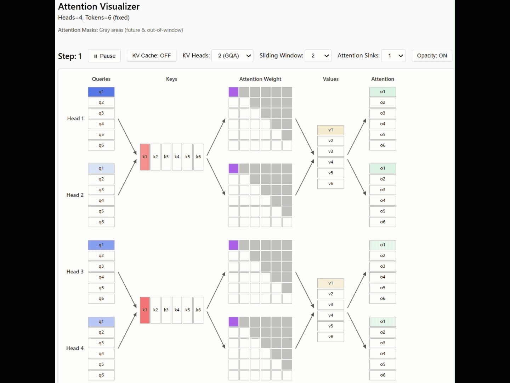

# Attention Visualizer

An interactive visualization tool for understanding attention mechanisms in transformer models, including Multi-Head Attention (MHA), Grouped Query Attention (GQA), and Multi-Query Attention (MQA). Also supports KV caching, sliding window attention, and attention sinks visualization.

    

## Features

- **Multiple Attention Types**: Supports MHA, GQA, and MQA visualization
- **KV Cache Visualization**: Shows cached values with hatched patterns to understand inference optimization
- **Sliding Window Attention**: Configurable attention window sizes for local attention patterns
- **Attention Sinks**: Allows attention to initial tokens in sliding window for efficient streaming
- **Interactive Visualization**: Color-coded highlighting with play/pause animation and step-by-step exploration

## References

### Papers
- [Attention Is All You Need](https://arxiv.org/abs/1706.03762) - Vaswani et al., 2017 (Multi-Head Attention)
- [GQA: Training Generalized Multi-Query Transformer Models from Multi-Head Checkpoints](https://arxiv.org/abs/2305.13245) - Ainslie et al., 2023 (Grouped Query Attention)
- [Fast Transformer Decoding: One Write-Head is All You Need](https://arxiv.org/abs/1911.02150) - Shazeer, 2019 (Multi-Query Attention)
- [Transformer-XL: Attentive Language Models Beyond a Fixed-Length Context](https://arxiv.org/abs/1901.02860) - Dai et al., 2019 (KV Cache)
- [Longformer: The Long-Document Transformer](https://arxiv.org/abs/2004.05150) - Beltagy et al., 2020 (Sliding Window Attention)
- [Efficient Streaming Language Models with Attention Sinks](https://arxiv.org/abs/2309.17453) - Xiao et al. 2024 (Attention Sinks)

### Resources
The attention calculation animation was inspired by this resource. Thank you!

- [Transformers KV Caching Explained](https://medium.com/@joaolages/kv-caching-explained-276520203249) - João Lages, 2023

The interactive visualization approach was inspired by the following Convolution visualizer:

- [Convolution Visualizer](https://ezyang.github.io/convolution-visualizer/) - Edward Z. Yang

## Contributing

We welcome contributions to improve the Attention Visualizer!

## Development Notes

This repository was created through vibe coding with ChatGPT o3 and GitHub Copilot (Claude Sonnet 4).
